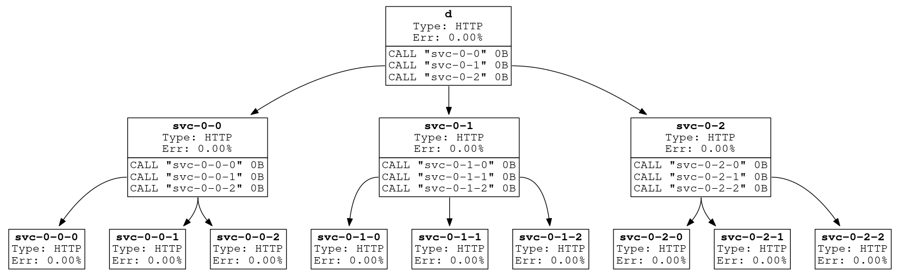

# Isotope Tree



This test app was generated using [Istio Isotope](https://github.com/istio/tools/tree/master/isotope).

## Installation

Create namespace:

```
$ kubectl create ns isotope
```

Label namespace for Istio sidecar injection:

```
$ kubectl label ns isotope istio-injection=enabled
```

Deploy chart release:

```
$ helm install isotope-tree . \
    --namespace isotope \
    --create-namespace \
    --set replicaCount=5 \
    --set nodeSelector.role=exp-subject
```

## Uninstallation

Delete chart release:

```
$ helm delete --purge isotope-tree
```
